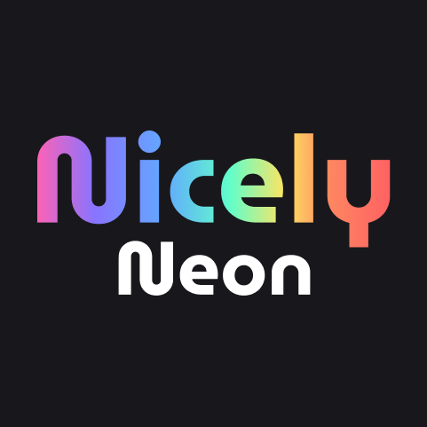

# Nicely Neon Theme

A vibrant dark theme for Visual Studio Code with beautiful neon colors that make coding a delight.

## Preview

## Colors

This theme features carefully crafted neon colors:

- **Red** - Keywords and important elements
- **Orange** - Operators and warnings
- **Yellow** - Functions and highlights
- **Green** - Strings and success elements
- **Cyan** - Classes and types
- **Blue** - Methods and special functions
- **Purple** - Attributes and secondary elements
- **Pink** - Special cases and accents

## Installation

1. Open **Extensions** sidebar panel in VS Code. `View → Extensions`
2. Search for `Nicely Neon Theme`
3. Click **Install** to install it
4. Click **Reload** to reload your editor
5. Code → Preferences → Color Theme → **Nicely Neon**

## Manual Installation

1. Download the extension from the marketplace
2. Open VS Code and go to Extensions
3. Click the three dots menu and select "Install from VSIX..."
4. Select the downloaded .vsix file

## What's New

See [CHANGELOG.md](CHANGELOG.md) for details.

## Contributing

Found a bug or have a suggestion? Please file an issue on [GitHub](https://github.com/yourusername/nicely-neon-theme/issues).

## License

[MIT License](LICENSE)

---

**Enjoy coding with neon vibes!** ✨
