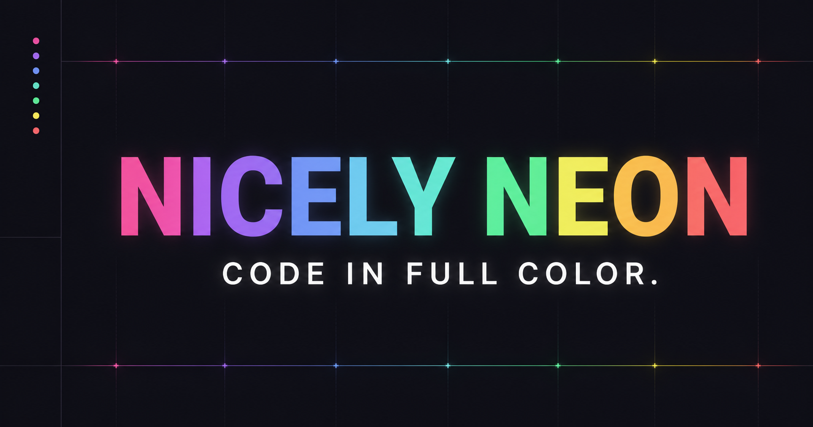
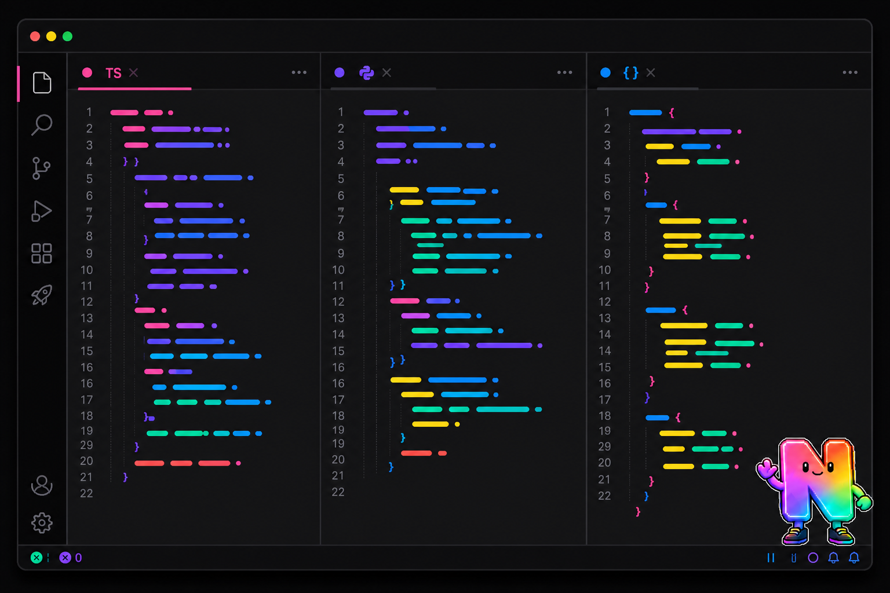
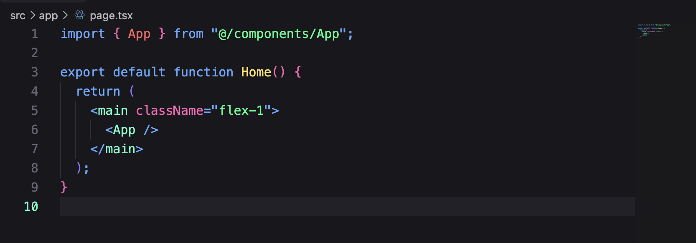
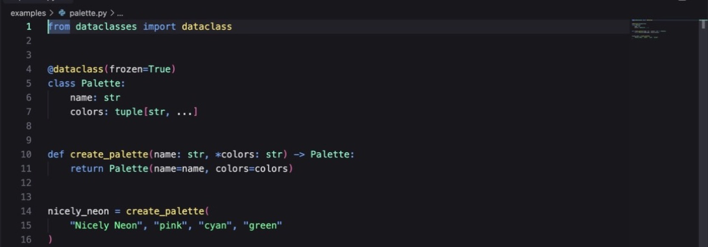

<div align="center">



# Nicely Neon

**A vivid, carefully balanced dark theme for Visual Studio Code.**

Seven focused neon colors make syntax easy to scan without turning your editor into visual noise.

[Install from the Marketplace](https://marketplace.visualstudio.com/items?itemName=eight84.nicely-neon-theme) · [Explore the landing page](https://nicely-neon-theme.netlify.app/) · [Visit eight84.com](https://eight84.com)

</div>

## See it in action



Nicely Neon keeps the editor chrome quiet and gives each syntax family a clear job. The result is colorful at a glance, but calm enough for long sessions.

## The color system

| Color | Hex | Used for |
| :--- | :--- | :--- |
| 🩷 Hot pink | `#FE62B5` | Attributes, properties, and storage keywords |
| 🟣 Violet | `#8974FF` | Decorators and special symbols |
| 🔵 Electric blue | `#62A8FE` | Keywords and language controls |
| 🩵 Cool cyan | `#62FECA` | Types, classes, and constants |
| 🟢 Signal green | `#1AFF90` | Strings and inserted content |
| 🟡 Warm yellow | `#FEE462` | Functions and callable symbols |
| 🔴 Alert red | `#FE6262` | Errors, invalid tokens, and destructive states |

Selections use a balanced graphite gray (`#4D4D58`) so highlighted text stays visible without fighting the syntax colors.

## Real editor captures

### TypeScript + React



### Python



*Captured directly in VS Code with Nicely Neon—matching dimensions, no alternate syntax highlighter, and no recoloring.*

GitHub renders fenced code examples with its own syntax colors, so screenshots are used here to show the theme accurately.

## Install

1. Open the **Extensions** view in VS Code.
2. Search for **Nicely Neon Theme**.
3. Select **Install**.
4. Run **Preferences: Color Theme** and choose **Nicely Neon**.

Or run:

```text
ext install eight84.nicely-neon-theme
```

[Open Nicely Neon in the Visual Studio Marketplace →](https://marketplace.visualstudio.com/items?itemName=eight84.nicely-neon-theme)

## What’s new in 2.0

- Complete modern workbench color coverage
- Semantic highlighting for stronger TypeScript, JavaScript, Python, and language-server support
- A clearer graphite selection color, improved comments, indent guides, and active states
- Matching terminal, Git, diff, notification, menu, and minimap colors
- Automated theme validation and a release-ready project structure

## Development

Validate the manifest and theme structure:

```bash
npm run check
```

Create an installable VSIX package:

```bash
npm run package:vsix
```

The landing page lives in `website/` and has its own development commands.

## Contributing

Issues and pull requests are welcome. If a token looks wrong, include the language, a small code sample, and the scope name when possible.

## License

[MIT](./LICENSE.txt) · Made with color by [eight84](https://eight84.com)
