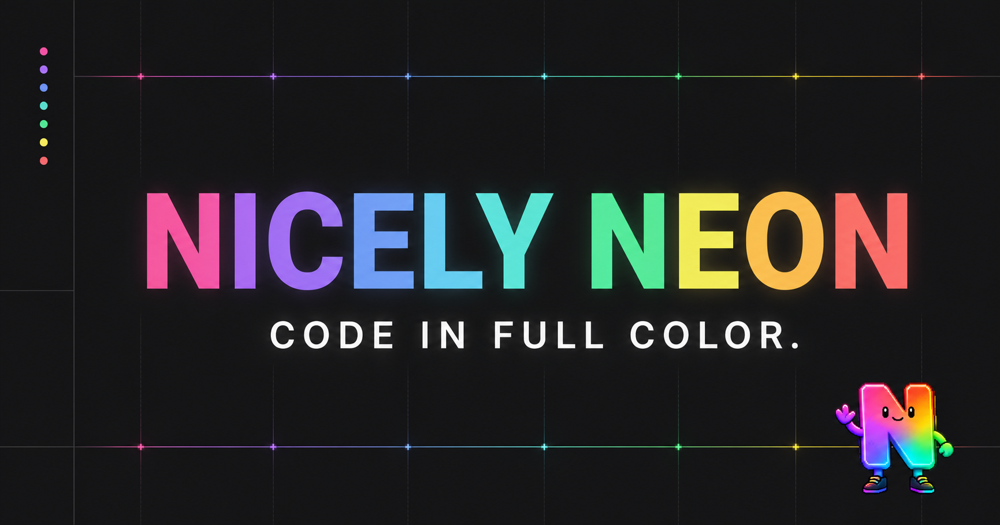
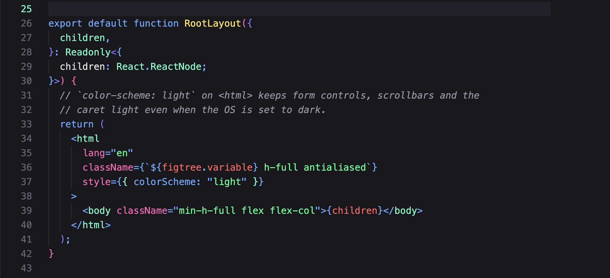
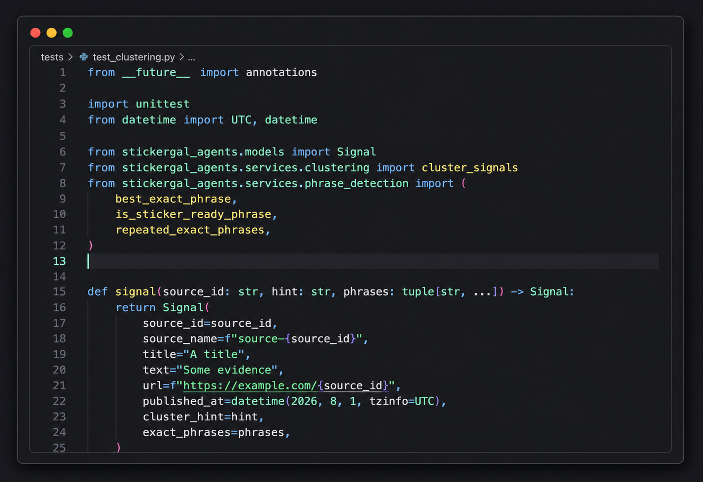
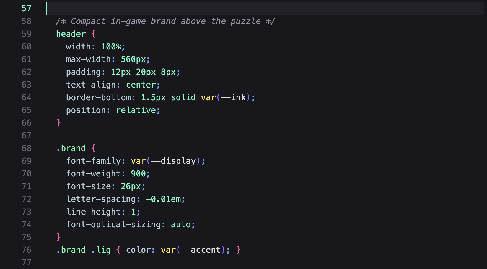
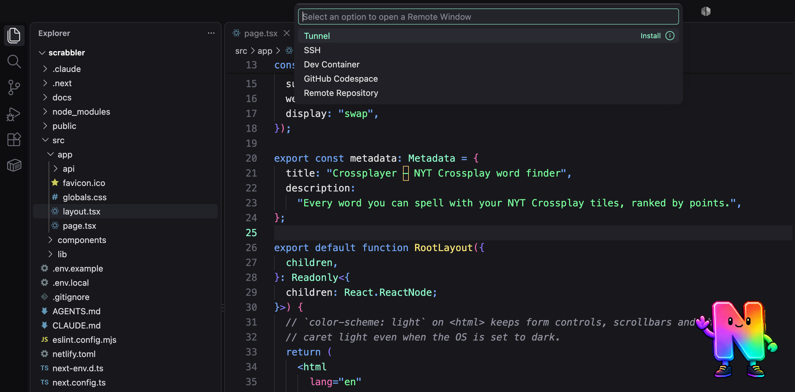

<div align="center">



# Nicely Neon

**A vivid, carefully balanced dark theme for Visual Studio Code, Cursor, and PyCharm.**

Seven focused neon colors make syntax easy to scan without turning your editor into visual noise.

[Install from the Marketplace](https://marketplace.visualstudio.com/items?itemName=eight84.nicely-neon-theme) · [Use in Cursor](#cursor) · [Explore the landing page](https://nicely-neon-theme.netlify.app/) · [Visit eight84.com](https://eight84.com)

</div>

## Preview

### TypeScript + React



### Python



### CSS



### Full workspace



*Captured in VS Code with Nicely Neon and framed consistently for documentation.*

Nicely Neon keeps the editor chrome quiet and gives each syntax family a clear job. The result is colorful at a glance, but calm enough for long sessions.

## The color system

| Color | Hex | Used for |
| :--- | :--- | :--- |
| 🩷 Hot pink | `#FE62B5` | Attributes, properties, and storage keywords |
| 🟣 Violet | `#8974FF` | Decorators and special symbols |
| 🔵 Electric blue | `#62A8FE` | Keywords and language controls |
| 🩵 Cool cyan | `#62FECA` | Types, classes, and constants |
| 🟢 Signal green | `#1AFF90` | Strings and inserted content |
| 🟡 Warm yellow | `#FEE462` | Functions and callable symbols |
| 🔴 Alert red | `#FE6262` | Errors, invalid tokens, and destructive states |

Selections use a balanced graphite gray (`#4D4D58`) so highlighted text stays visible without fighting the syntax colors.

## Install

### Visual Studio Code

1. Open the **Extensions** view in VS Code.
2. Search for **Nicely Neon Theme**.
3. Select **Install**.
4. Run **Preferences: Color Theme** and choose **Nicely Neon**.

Or run:

```text
ext install eight84.nicely-neon-theme
```

[Open Nicely Neon in the Visual Studio Marketplace →](https://marketplace.visualstudio.com/items?itemName=eight84.nicely-neon-theme)

### Cursor

Cursor supports VS Code color-theme extensions, so Nicely Neon uses the same `.vsix` package in both editors.

To install the package directly:

1. Download the latest `nicely-neon-theme-*.vsix` package.
2. In Cursor, open the Command Palette.
3. Run **Extensions: Install from VSIX...** and select the downloaded file.
4. Run **Preferences: Color Theme** and choose **Nicely Neon**.

If Nicely Neon is already installed in VS Code, Cursor can also import your VS Code extensions and themes from **Cursor Settings → General → Account → VS Code Import**.

### PyCharm and other JetBrains IDEs

Download [`Nicely-Neon.icls`](./themes/Nicely-Neon.icls), then:

1. Open **Settings/Preferences → Editor → Color Scheme**.
2. Open the scheme menu next to the color-scheme selector.
3. Choose **Import Scheme**, select `Nicely-Neon.icls`, and apply **Nicely Neon**.

The `.icls` file is the only download needed for the editor color scheme. It works with PyCharm and other IntelliJ Platform IDEs. PyCharm's surrounding application UI remains on its selected dark theme; a complete replacement of the IDE chrome would require a separate theme-plugin `.jar`.

## What’s new in 2.0

- Complete modern workbench color coverage
- Semantic highlighting for stronger TypeScript, JavaScript, Python, and language-server support
- A clearer graphite selection color, improved comments, indent guides, and active states
- Matching terminal, Git, diff, notification, menu, and minimap colors
- Automated theme validation and a release-ready project structure

## Development

Validate the manifest and theme structure:

```bash
npm run check
```

Create an installable VSIX package:

```bash
npm run package:vsix
```

The generated VSIX works in both VS Code and Cursor.

The landing page lives in `website/` and has its own development commands.

## Contributing

Issues and pull requests are welcome. If a token looks wrong, include the language, a small code sample, and the scope name when possible.

## License

[MIT](./LICENSE.txt) · Made with color by [eight84](https://eight84.com)
