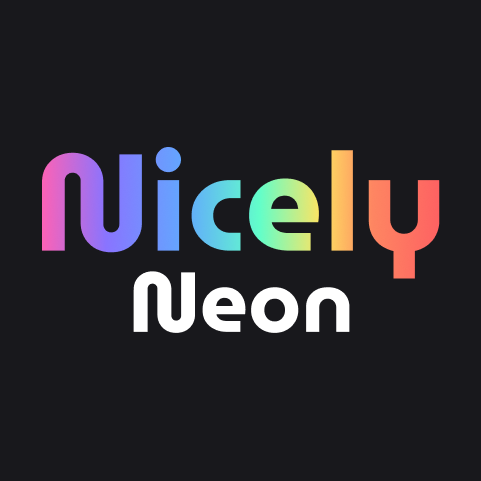

# Nicely Neon

A vivid, carefully balanced dark theme for Visual Studio Code. Nicely Neon uses a focused seven-color system to make syntax easy to scan without turning the editor into visual noise.

## Install

1. Open the **Extensions** view in VS Code.
2. Search for **Nicely Neon Theme**.
3. Select **Install**.
4. Run **Preferences: Color Theme** and choose **Nicely Neon**.

You can also install it directly from the [Visual Studio Marketplace](https://marketplace.visualstudio.com/items?itemName=eight84.nicely-neon-theme).

## Palette

| Role | Color |
| --- | --- |
| Keywords and language controls | `#62A8FE` |
| Functions and callable symbols | `#FEE462` |
| Strings | `#1AFF90` |
| Types and constants | `#62FECA` |
| Attributes and properties | `#FE62B5` |
| Decorators and special symbols | `#8974FF` |
| Errors and destructive states | `#FE6262` |

## What changed in 2.0

- Complete modern workbench color coverage
- Semantic highlighting for stronger TypeScript, JavaScript, Python, and language-server support
- Clearer comments, selections, indent guides, and active states
- Matching terminal, Git, diff, notification, menu, and minimap colors
- Automated theme validation and a release-ready project structure

## Development

Run `npm run check` to validate the manifest and theme structure. Run `npm run package:vsix` to create an installable VSIX package.

The landing page lives in `website/` and has its own development commands.

## Contributing

Issues and pull requests are welcome. If a token looks wrong, include the language, a small code sample, and the scope name when possible.

## License

[MIT](./LICENSE.txt)
